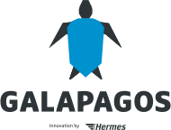

# galapagos

<p align="center">

</p>

Galapagos is a DevOps Self-Service Software for Apache Kafka, including an opinionated approach on how to use Kafka for
event-driven enterprise architecture.

## Fundamentals

See [Event-Driven Architecture Principles](event_driven_architecture_principles.md) for our principles for an
Enterprise-wide Event-Driven Architecture, and [Kafka Guidelines](kafka_guidelines.md) for the guidelines for Kafka
usage which result directly from these principles. Galapagos is our tool to "enforce" these Guidelines, while not
putting additional burden on DevOps teams.

## Demo Setup

The new Demo Setup uses [Confluent Cloud](https://www.confluent.io/confluent-cloud/), a SaaS solution for Apache Kafka.

You can use an existing subscription if you have one, or create a new subscription during the demo setup.
No credit card is required for this subscription; Confluent offers a 60-day trial period, including 400 USD to
spend on Kafka usage.

Just clone this repository, and run

```bash
./start-demo.sh
```

to setup and start the Galapagos Demo locally. Afterwards, browse http://localhost:8080/ to access Galapagos.
Use `user1/user1` for a "normal user" login, or `admin1/admin1` for an Administrator login.

Demo setup includes a local Apache Keycloak which will be downloaded and configured.

**Windows users**: Please install [Git for Windows](https://git-scm.com/download/win) (most likely you already have),
and **use the included Git Bash** to run the `start-demo.sh` script. We currently do not support Windows cmd or
PowerShell, as we really can do more useful stuff in our spare time (but hey, feel free to contribute that!).

A demo for the **certificate-based mode** of Galapagos (see below) is also available -
see [Demo Setup](./docs/Demo%20Setup.md).
But you should really start with the Confluent Cloud-based demo - extending your configuration for your own local Kafka
clusters later is easier once you are familiar with Galapagos.

## Status

Currently, Galapagos supports self-hosted Kafka Clusters which **must** use Client Certificate-based authentication, as
well as **Confluent Cloud** with their API Key + Secret mechanism. Teams can generate API Keys + secrets for their
applications via the Galapagos UI (or via REST).

**[Discussions](https://github.com/HermesGermany/galapagos/discussions)** are now live! Get in touch - let us talk about
the fundamentals, the setup, recommendations for others...

## Build

To build Galapagos, just run

```
mvn package
```

to get a Spring Boot executable JAR.

## Run

To run Galapagos locally for a first demo, just use `start-demo.sh` for startup. This will execute the one-time setup,
if required.

In **production**, you should use one of the Galapagos Docker images available
at [DockerHub](https://hub.docker.com/r/hermesgermany/galapagos/tags). Recommended is using Kubernetes as execution
environment. Configuration can be provided e.g. via ConfigMaps. See
[Kubernetes Docs](docs/Kubernetes.md) for details.

## Develop

The Demo Setup (`start-demo.sh`) also is a good start for local development. Of course, you can just change the code of
Galapagos, and then re-run the `start-demo.sh` script - but that is a little inefficient.

A better approach would be to create at least two "Run Configurations" in your favourite IDE: One for the backend, and
one for the frontend.

The backend should be a Spring Boot Application, running the Main class
`com.hermesworld.ais.galapagos.GalapagosApplication`, and having these Spring Profiles active: `demo,democonf,actuator`.

The frontend should be an Angular Application based on the `ui` subdirectory - or just run `npm run start` in the `ui`
subdirectory.

And the downloaded and configured Keycloak can just run all the time - use the helper script `start-keycloak.sh` for
this.

Once you are finished with a cool new feature or a bugfix, see [CONTRIBUTING.md](./CONTRIBUTING.md) for details on how
to create Pull Requests.

## Migrate

Some new versions of Galapagos require extra migration effort:

* [Galapagos 2.6.x and 2.7.x to 2.8.0 Migration Guide](./docs/Migration%20Guide%202.8.md)
* [Galapagos 2.5.x to 2.6.0 Migration Guide](./docs/Migration%20Guide%202.6.md)
