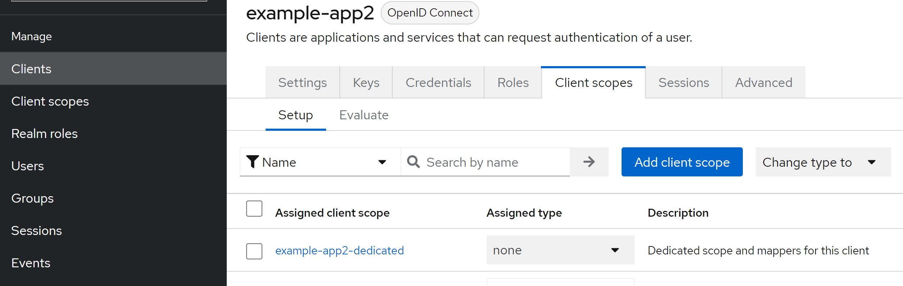
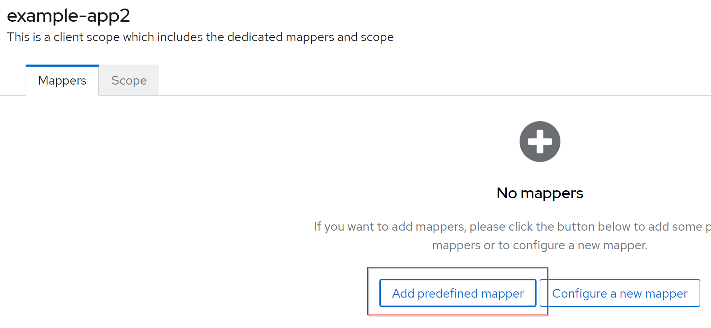
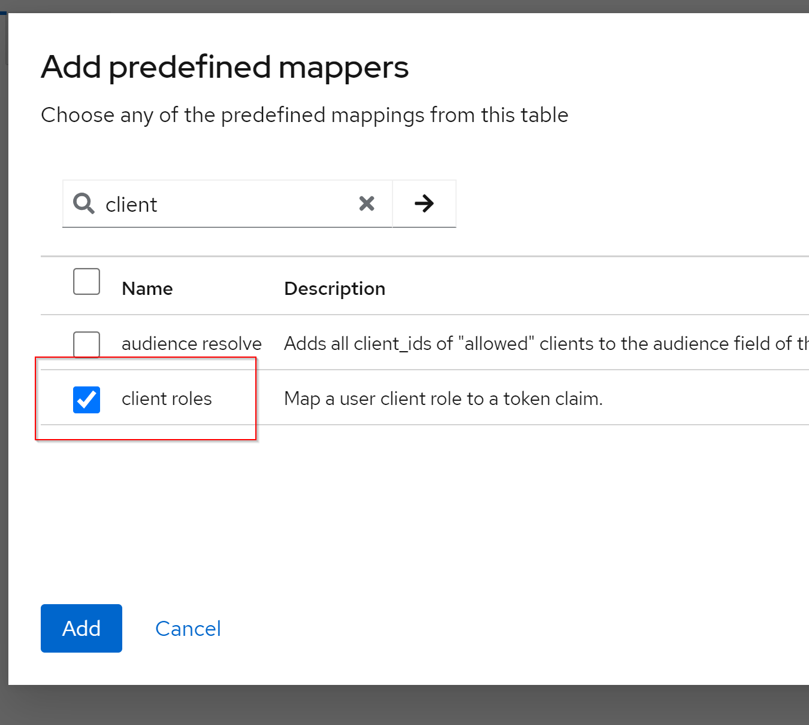
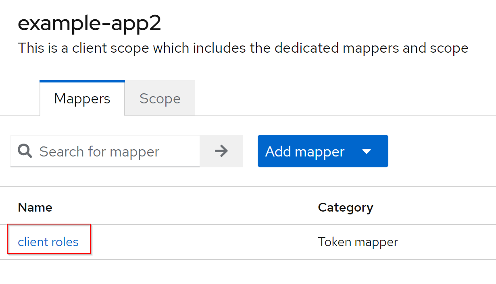
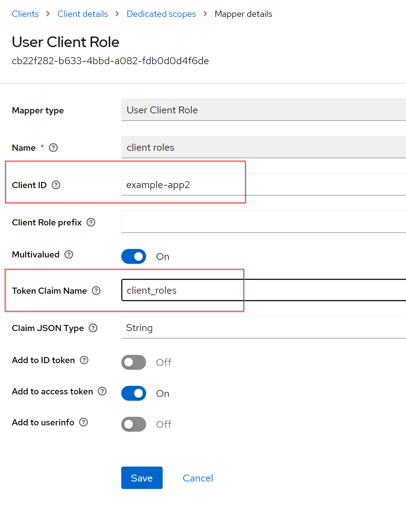

# Galapagos 2.6.x-2.7.0 to 2.8.0 Migration Guide

## Spring Boot 3

Galapagos 2.8.0 uses Spring Boot 3 together with Spring Security 6. As Keycloak deprecated most of their adapter
libraries, and the latest one is not fully compatible to Spring Security 6, we had to replace it, using standard
Spring Security OAuth2 mechanisms (which is, by the way, great, as this now allows to use other OAuth2 providers as
well).

Unfortunately, this required some **breaking changes** in the way authentication and authorization is configured in
Galapagos.

## Authentication Details

Previously, core element of configuration was a `keycloak.json` file which could be configured to be used. The Keycloak
adapter library as well as the frontend used this for authentication and authorization via Keycloak.

Now, configuration is done via standard Spring Security properties, and some Galapagos-specific properties as well.
You will find a good starting point in [application-oauth2.properties](../application-oauth2.properties) in the root
of the project.

## Authorization

Galapagos uses OAuth2 not only for **authentication**, but also for **authorization** of the users. Users are expected
to have the roles `user` and, optionally, `admin` listed somewhere in their access token.

With Keycloak, this was more or less a Keycloak standard you could achieve with some attributes in the `keycloak.json`,
and the roles were mapped automagically to the Spring Security Context.

Now, we have to extract role information ourselves from the Access Token, and we have to know from where. Spring
Security offers a helper for this, but this helper only supports "top-level" attributes (claims) in the Token as source,
not nested ones like the ones Keycloak is using by default.

This means we will also have to adjust **Keycloak itself** to provide the user's roles in a top-level claim in the
token.

# Putting it all together

To migrate to Galapagos 2.8.0, you will have to perform the following steps (explained in detail below):

1. Adjust Keycloak to provide user roles in a top-level claim in the access token
2. Configure OAuth2 properties, or at least an environment variable, to match your Identity Provider
3. Remove previous Keycloak-specific configuration properties and files.

## 1. Adjust Keycloak

As described above, Galapagos now requires the user's roles (at least `user`, optionally `admin` for Galapagos admins)
to be in a top-level claim in the Access Token. This can be achieved using a "client roles token mapper", which can be
configured on the affected client.

First of all, open the Admin Console of Keycloak and navigate to your client which is used for Galapagos. In our
example, it is `example-app2`. Click on the "Client scopes" tab.



Click on the (usually) first entry in the scopes list, which should be similar to the ID of the client (in our example,
`example-app2-dedicated`).

If no mappers are yet defined for your client, the following page will occur. (Otherwise, if you already have one or
more mappers, just click "Add Mappers" on the screen with your mappers.)



Click on "Add predefined mapper". In the popup, enter `client` as the filter text and click the arrow to filter the
list. Select "client roles" and click the "Add" button.



Now, we have to configure the newly added mapper. In the list of mappers which is now displayed, click the newly added
mapper:



And you will get to the "edit" page of this mapper, where you can control the behaviour of the mapper. Select the
ID of your client as the client ID, and enter e.g. "client_roles" as the name of the claim to be used in the
Access Token. **Important**: Do **not** leave the default value here, which adds some "sub-objects" in the access token.
The roles claim **must** be on top level in the Access Token!



Click "Save" here, and you are done on the Keycloak side. Phew!

## 2. Configure OAuth2 properties

Well, depending on your setup, this **could** be an almost no-brainer. See the default new
`application-oauth2.properties` in the project root (comments removed for brevity):

```properties
spring.security.oauth2.client.registration.keycloak.client-id=${keycloak.client.id}
spring.security.oauth2.client.registration.keycloak.scope=openid,profile,email,offline_access
spring.security.oauth2.client.registration.keycloak.authorization-grant-type=authorization_code

spring.security.oauth2.client.provider.keycloak.issuer-uri=${keycloak.url}/auth/realms/${keycloak.realm:galapagos}
spring.security.oauth2.client.provider.keycloak.user-name-attribute=preferred_username

spring.security.oauth2.resourceserver.jwt.issuer-uri=${spring.security.oauth2.client.provider.keycloak.issuer-uri}
spring.security.oauth2.resourceserver.jwt.jwk-set-uri=${spring.security.oauth2.resourceserver.jwt.issuer-uri}/protocol/openid-connect/certs

galapagos.security.jwt-username-claim=preferred_username
galapagos.security.jwt-display-name-claim=name
galapagos.security.jwt-email-claim=email
galapagos.security.jwt-role-claim=client_roles
```

This is how a standard OAuth2 configuration would look like for using Keycloak as Identity Provider.
You can see that some placeholder variables are used here. You now have all the options Spring offers:

* Use this configuration file and provide variables via e.g. environment variables or program arguments
* Copy this configuration file and replace properties to your needs
* Incorporate this configuration in your existing Galapagos configuration

For example, you could just copy this properties file to your execution environment, add `oauth2` to the
`spring.profiles.active` configuration, and provide `KEYCLOAK_CLIENT_ID` and `KEYCLOAK_URL` (and, optionally,
`KEYCLOAK_REALM`) as environment variables.

If you want to use a different Identity Provider than Keycloak, refer
to [Spring Security OAuth2 Resource Server Docs](https://docs.spring.io/spring-security/reference/servlet/oauth2/resource-server/jwt.html)
for more information. But we highly recommend to first perform the Galapagos 2.8 migration **with** Keycloak, and
**then** switching the Identity Provider, if desired.

## 3. Remove previous Keycloak-specific configuration

To complete the migration, remove your `keycloak.json` or whatever the name of your Keycloak config JSON file is, and
remove the configuration property `keycloak.configurationFile` from your configuration. Now try running Galapagos with
your new settings. If you encounter any problems, have a look into
the [Discussions](https://github.com/HermesGermany/galapagos/discussions), or create
a [GitHub issue](https://github.com/HermesGermany/galapagos/issues).
