# Galapagos User Guide

## Log in / First access

When first opening Galapagos, you need to authenticate yourself. You will see 
a small window asking you for your keycloak credentials. Here you can enter 
a valid combination of username and password. 

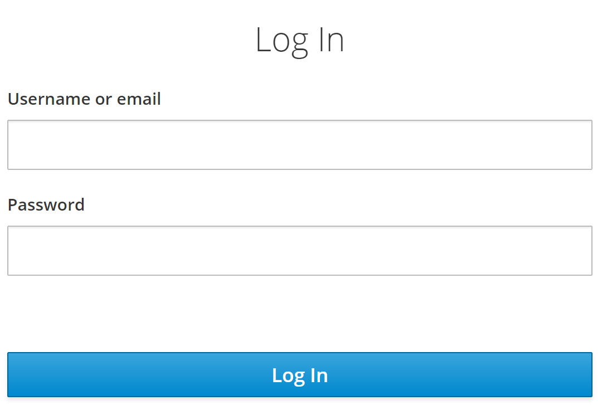

After successfully entering your username and password, you will be redirected to
Galapagos and landed on the start screen.


You can already find several elements here:

  * The menu on the left. Here you can jump to the individual main functions of Galapagos.
  * The info bar above. Here you can change the current Kafka environment and also change the language of the user interface. 
  * The individual pages, which are discussed in more detail in the following sections.

## Get basic and connection information

On the dashboard, which is shown on the screenshot above, you will find the following elements:

  * Information about the current Kafka cluster.You can use the "Bootstrap Servers" e.g. in your
    properties file for the Kafka connection in your application (Kafka property `bootstrap.servers`).
  * Useful start links. 
  * The "Latest Changes" on the selected Kafka cluster.
  * The Galapagos version.
  
  The first thing you will find under the start links (as shown in the image below based on `spring` framework) is the so-called "Kafka Truststore". This is simply a 
  Java keystore (JKS format) that contains the (self-signed) root certificates of the individual Kafka environments 
  as "Trusted Certificates". If you integrate this truststore via your Kafka properties (standard Kafka properties 
  `ssl.truststore.location` and `ssl.truststore.password`, password = changeit), your Kafka client trusts the Kafka 
  clusters when establishing the connection.
  
  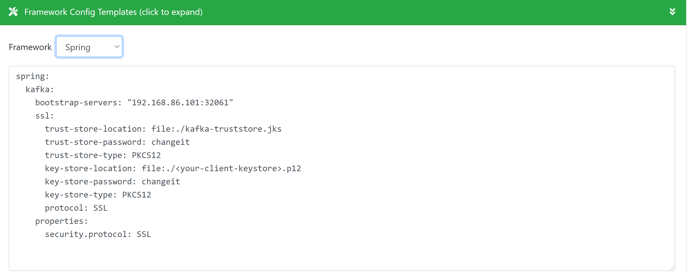
  
  Please note that you also need a client certificate to establish a successful connection! Information on this can
  be found below in the section "Receive a client certificate".

## Search Topics

  To search for existing "API-Topics" (Topics that are visible to everyone and generally readable as soon as the application
  has subscribed to the topic, see section "Subscribe to topic") on the current Kafka environment go to the menu "Browse Topics".
  The following screen appears:
  
  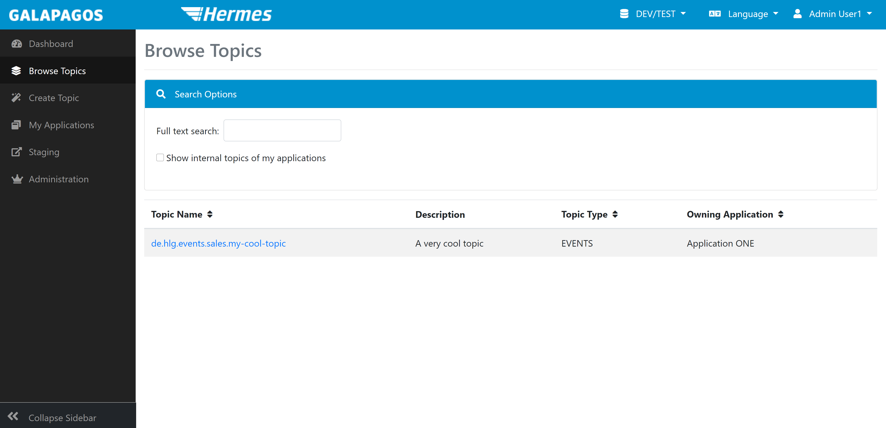 

  You can sort the topics here and search (filter) names, descriptions and owning applications. To sort, click on the double arrows
  next to the column headings. To filter, enter a search text in the text box above.

  If you are already "Topic Administrator" for one or more applications (see next section), you can make internal topics of these 
  applications visible with the checkmark "Show internal topics of my applications". 
  
  To view details about a topic, click on the topic name. Here, in addition to the information that was already visible in the table,
  you can usually see the JSON schema of the content of the topic (if one has been published), and see who has already subscribed
  to this topic.
  
## Become a topic administrator

   In order to be able to do more extensive actions with Galapagos (especially create or subscribe to topics), you have to
   become "Topic Administrator" of at least one application. To do this, switch to "My Applications" via the menu
   on the left. Here you can make a request to become a topic administrator of an application. Then select an application 
   in the "Request" section.Then enter a comment why you should get this right (e.g. "Developer in Team XYZ"). This comment is optional, 
   but makes it easier for the Galapagos admins to check whether to grant Topic Administrator role or not. Then click on "Submit Request". 
   Your request will be saved, and the Galapagos admins will receive an email to review and approve the request.
   
   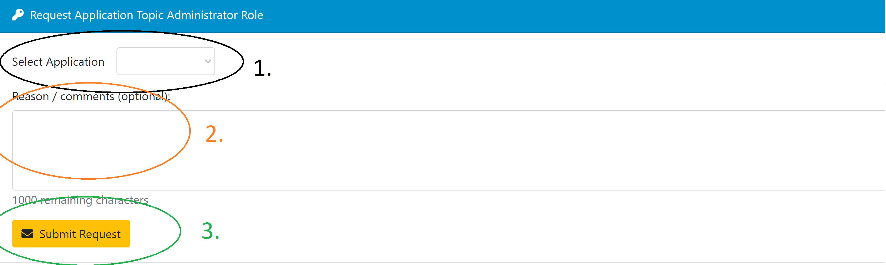
   
   After an administrator has checked and approved your request, you will also receive an email informing you of this. You can
   then use the extended functions of Galapagos for this application.
   
## Generate client certificate      

   In order to connect to the kafka cluster and to be able to store application rights, it is necessary to have a client certificate
   issued. Without a certificate for an application, you cannot create topics for this application via Galapagos. To generate such a
   client certificate, go to "My Applications" and click on "Create Certificate now" for one of your application on the environment for which you want to get 
   a client certificate:

   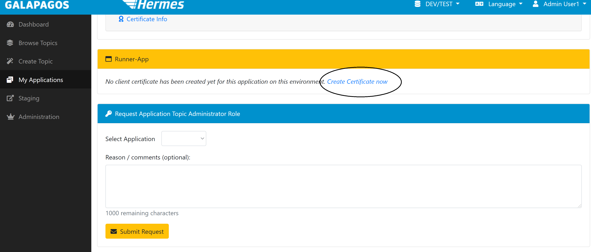
   
   A dialog for generating the certificate in the selected Kafka cluster opens:

   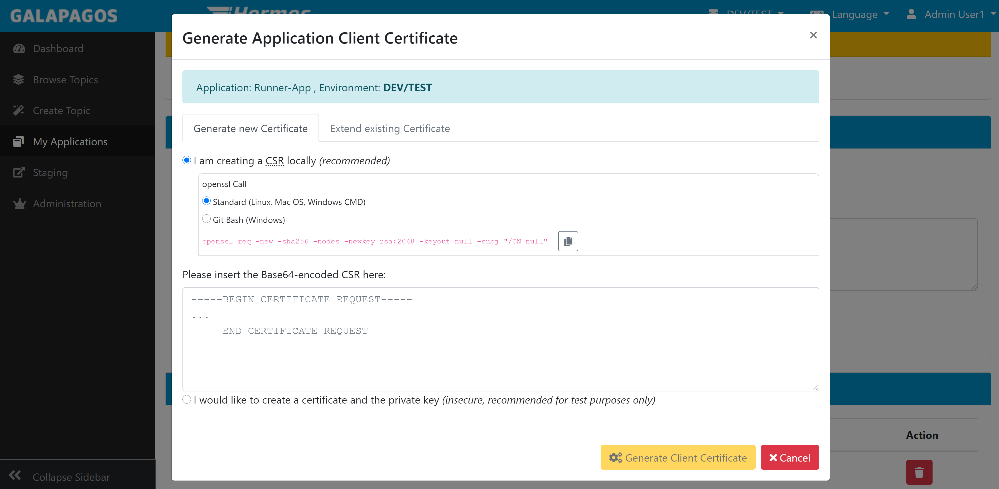

  There are two options for generating the certificate. You can either have the private key and the certificate
  generated by Galapagos and receive a finished .p12 file, or you can upload a CSR (Certificate Signing Request)
  and receive (only) the signed certificate back. For security reasons, only the CSR variant is permitted for 
  the productive cluster (so that the private key is not transmitted over the network).
  
   Select one of the two options in the dialog above. Depending on how you decide, your browser downloads a file
   after clicking on "Generate Client Certificate":
  
   * When using a CSR, you will receive the signed certificate as a .cer file (PEM-coded X509)
   * When the private key is generated by Galapagos, you will receive a .p12 file that is "protected" with the password "changeit". 
     You can use this directly as a client certificate for your Kafka client via the Kafka properties `ssl.keystore.location`,
     `ssl.keystore.password` and `ssl.key.password`.
     
   When choosing the CSR variant, Galapagos gives you a finished openssl command that you just have to copy and paste into the
   command line or Git Bash and execute (choose which type of command line you are using)! A key file (.key) is created (that means
   you need write access to the current directory in your terminal!) And the CSR is output on the command line. You can
   in turn copy and paste this into Galapagos: 


   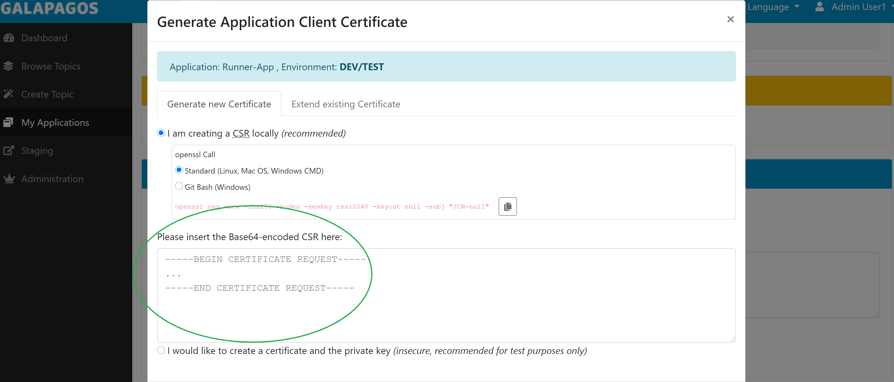
   
   When you have received the signed certificate, you can use openssl to create a .p12 file (Windows; under Linux or Mac OS you
   can omit winpty):

```
winpty openssl pkcs12 -export -out myapp.p12 -inkey myapp.key -in myapp.cer
```

   openssl asks for an "Export Password". This is the password with which the .p12 file is protected (after all it
   contains your private key!). Galapagos always uses "changeit" for .p12 files (see above). You can use whatever
   you want here - you just have to specify it in your Kafka Properties together with the file.
   
### Extend certificate      

   If the client certificate for your application is about to expire, you can extend it via the user interface. 
   To do this, go back to the certificate dialog for the respective environment, but now switch to
   the "Extend existing Certificate" tab:
   
   
   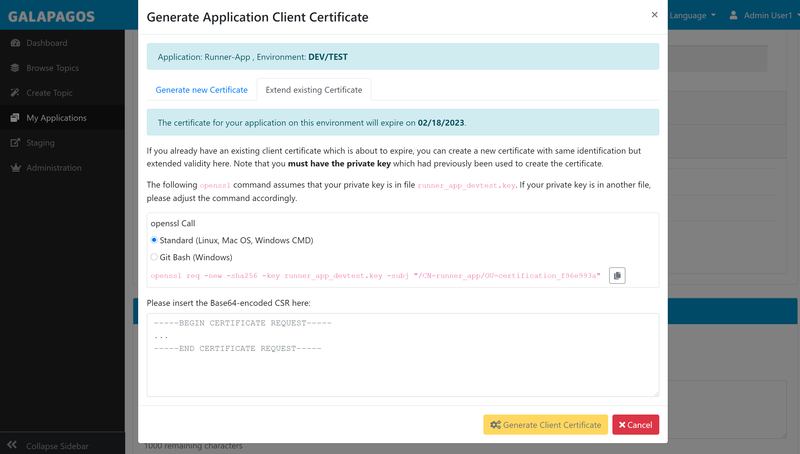

   Note that the expiration date is also shown in this dialog. So you can always check the expiration date here. 
   You will of course be notified by Galapagos when the certificate is about to expire.

   You will also find an openssl command here. However, this now requires that you still have the private key for the existing certificate. If you "only" have the .p12 file, you can
   extract the private key as follows: 
   
```
winpty openssl pkcs12 -in <myclientkeystore.p12> -nocerts -nodes -out <myprivatekey.key>
```

   You will then be asked for the password for your P12 keystore on the command line, so don't forget
   the winpty (under Windows), otherwise the openssl process will hang! 
   
   Otherwise you can proceed as described above. Execute the command that Galapagos lists for you and
   copy the CSR to Galapagos into the text box. You will now receive a certificate that contains the
   same identifier as your previous certificate (and uses the same private key), but is now (depending on
   the environment) again valid for 1 or 2 years. The previous certificate can still be used (as long as it
   is valid), just exchange it at the next opportunity.
   
### Replace certificate

   If you have lost the private key or have to recreate the client certificate for your application for a
   Kafka environment for other reasons, you can proceed in exactly the same way as when re-issuing the 
   certificate (but not as with the renewal). Please note, however, that the previous certificate immediately
   loses its validity when the new certificate is generated! If the application is already running 
   productively with the private key and you "just" can no longer access it, you could kill your 
   productive application! Galapagos will warn you when trying to generate a new certificate, if you already 
   have one:
   
   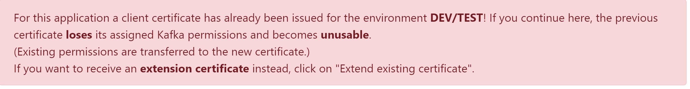
   
## Create developer certificate   
       
   Depending on your team organization and deployment strategy, not every developer should have the private key of 
   your application on the personal computer - especially not for production. You may still have to be able to look 
   at the topics during production, for example. There are tools for this, but of course these also require a client
   certificate (and the trust store) for the connection to connect to Kafka. 
   
   Therefore, you can get a developer certificate with Galapagos. This basically grants you the same rights as the
   applications of which you are the Topic Administrator ("My Applications"), but are always very limited in time. 
   Currently the times are 90 days on DEV / 
   , 30 days on INT and 10 days on PROD. Then you have to create a new
   certificate again - there is no extension.   
   
   To create a developer certificate, click on your name in the top right corner in Galapagos. Now select
   "User Settings" in the menu. The following screen opens:
   
   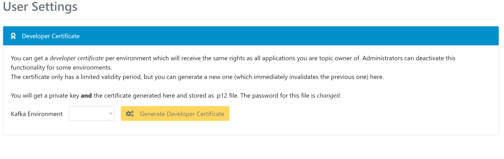
   
   Select an environment for which you would like to have a developer certificate. If you had already created one 
   this way, it becomes invalid immediately after the creation of a new certificate and loses its rights to the 
   corresponding environment.
   
   Click on "Generate developer certificate" and you will receive a .p12 file for download. The 
   password with which this file is protected is, as always, "changeit".
   Your username is encoded in the certificate - so you shouldn't make this file available centrally in the team.
   
## Create internal Topic   
   
   Internal Topics can be used for the communication between different components of your application.
   You can use Galapagos to create such an internal Topic. To do so, go to "Create topic" via the menu on
   the left. In the following screen you have to select the topic type "App internal". In addition,
   select your owning application and the target environment (the direct creation of topics is only 
   allowed on the DEV / TEST environment with Galapagos!). Galapagos automatically generates a
   suggestion for the topic name.
   
   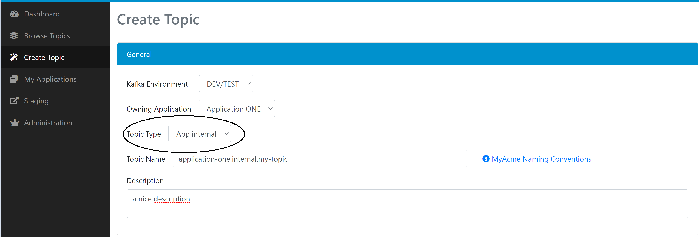
   
   You can also enter a description of the contents of this topic. This is not so important for
   application-internal topics, but it can help you or your team members. Note that users who do 
   not have the "Topic Administrator" right in Galapagos for your application cannot see this topic
   either! No other applications besides the selected application can read from or write to this 
   topic! Now Click on "Create topic" to create the topic on the selected Kafka cluster.
   
   
### Advanced topic settings   

   When creating the topic, you can already specify the number of partitions your topic should consist
   of. The default is 6 partitions. If you don't know what this setting does, you should definitely
   use the default value. If you use fewer partitions, you or the readers of the topic may rob you of 
   their scaling options. If you use too many, access to your topic may be less efficient.
   
   The number of partitions is **very difficult** to change after creation (and not at all via Galapagos).
   Therefore, when in doubt, you should think carefully about what you are setting here.
   
   You can change other advanced settings such as retention time and cleanup policy at any time **after**
   creating the topic, so they are not available here.
   
## Subscribe to a Topic   
   
   If you found an API topic from another application while browsing the topics that you would like to
   consume with your application, you have to subscribe to the topic for this application. This process
   grants the client certificate of the application in the Kafka cluster the right to read from this 
   topic.
   
   To subscribe to a topic, first select the topic via "Browse Topics" and click on it. Further down on
   the info page for this topic you will find the section for subscribing to it:
   
   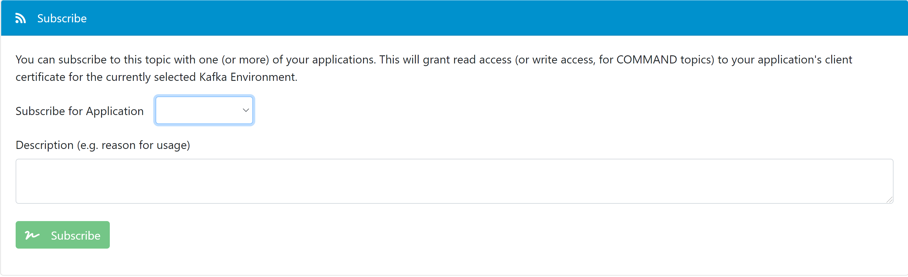
   
   Select the application that would like to read from this topic and click on "Subscribe". Your
   application will then appear at the top of the info page as a subscriber to this topic.
   
   If you have not yet created a client certificate for your application in the current environment,
   the Kafka rights cannot be assigned. Again, Galapagos will give you a warning if you do not have
   a client certificate yet:
   
   
   
   If the topic you want to subscribe to is marked as a "sensitive topic", e.g. because it contains personal data,
   the owning team must first **approve** your subscription before your application has read access to the topic.
   The owning team will be notified of your subscription request by email, and you will be notified by email if
   the approval has been granted or declined.
   
   To **cancel** your subscription (see screenshot below), click on the "Unsubscribe" Button behind the entry for your application in the list
   of subscribers to the topic. Note that in this case the rights to the current environment will be revoked
   immediately! So, if necessary, consider whether a productively running instance of your application could still
   be dependent on the subscription!
   
   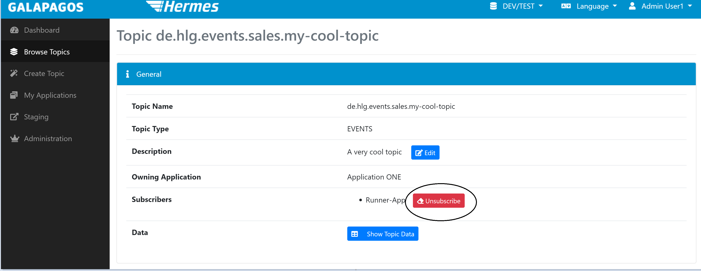
   
   
   
   
## Create API Topic

   At some point, you finally want to make one or more business events in your application available to other applications.   
   To create an API topic, proceed similarly as for internal topics. Select "Create topic" in the left menu and select target
   environment (only DEV / TEST is possible for creation) and your application. Now select the appropriate topic type, usually events.
   A few new input fields now appear:
   
   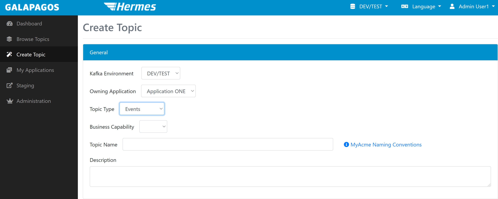
   
   One of the new fields is the business capability field. Select the appropriate one for you here. Again, Galapagos is
   calculates a suitable topic name from the selected values.
   
   The "Description" field now has a much more important role. Other users will see this as the first information on
   your topic and can even search through it. A meaningful description of the (future) content of the topic is therefore very helpful.
   

### Personal data in topics

   If your topic basically contains personal data (possibly only on a later stage, e.g. in production!), You have to mark this when you
   create the topic (see below). This marking has the effect that every subscription to this topic must be explicitly approved by you (by you or a member of
   your team who is also allowed to manage this topic in Galapagos). You as a team then have the responsibility to assess whether the 
   requesting team / the requesting application has a legitimate interest in this data.
   
   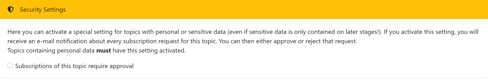
   
   
### Upload JSON schema   
   
   To rely on what is published on your topic, you should publish an associated **JSON schema**. You can specify this when creating the
   topic, but you don't have to. You can add the JSON schema at any time via the topic's info page (via "Browse Topics").
   Please note that Galapagos always **checks new schema versions for consumer compatibility**! Therefore, think carefully about what you 
   publish. You cannot make certain changes in a consumer-compatible manner (e.g. increasing the size of string fields if they were
   previously limited in length - perhaps the size of a database field depends on it somewhere and would then overflow). **Incompatible**
   changes usually require creating a new topic and marking the old topic as deprecated.
   When you want to stage your topic from DEV / TEST into production (see next section), you must have published an
   associated JSON scheme, otherwise Galapagos will refuse to stage the topic.
   
   
### Delete JSON schema   
   
   
   After a JSON scheme has been created, you can also delete it if you want to. It is important to note that only the last published JSON schema can be
   deleted. In addition, you cannot delete the JSON schema if there are subscribers on the respective topic or if the JSON schema to be
   deleted has already been staged. In the latter case, you must first delete it on the next stage in order to then also remove it on the
   current stage.
   
   If both conditions are met (the topic has no subscribers and the schema has not been staged) the button "Delete schema version" appears 
   on the user interface:
   
   
   
   You can of course use this button several times to remove all JSON schemas of a topic.
   
## Staging   
   
   If you are satisfied with your changes (this includes, for example, newly created topics, publishing Json Schemas, but also subscribing to an API
   topic) in the context of one of your applications, you can transfer the changes to the 
   next "stage". Galapagos knows the three stages DEV / TEST, INT and PROD.
   
   The staging ensures that the two environments do not completely diverge structurally. This way you are "encouraged" to test 
   your changes on DEV / TEST first before going into production.
   
   To transfer your changes for an application, select "Staging" in the left menu. Then select the desired source environment and
   the application. The target environment is calculated automatically.
   
   Then click on "Analyze Changes". If you have not yet created a certificate for your application on the target environment,
   you will be made aware of this at this point. Otherwise, Galapagos will show you the changes to
   be published to the next stage:
   
   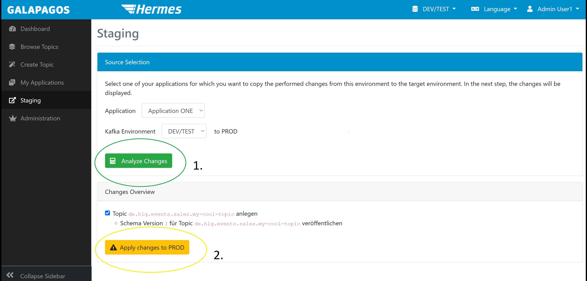
   
   In case you don't want to stage every changes to the next stage, just uncheck the respective checkbox.
   This way those changes will not be present on the next environment.
   
   With a click on "Apply changes to xy" the individual changes are carried out to the target environment. Galapagos will
   then show you which changes are successfully staged and which possibly not.
   

## Delete Topic

   Sometimes you certainly want to delete a topic. Of course, it's not that simple in a system that is intended for
   decoupled communication between different applications. Therefore, strict rules apply as to when and where which
   topic can be deleted:   

### Delete internal Topic

   If you want to delete an internal topic that you (or someone else from your team) created using Galapagos, you always
   have to do this on the DEV / TEST stage first. There you can search for your topic via "Search Topics", click on it 
   and find the "Danger Zone" at the bottom of the page to delete the topic. To confirm the deletion, enter
   the entire topic name into the input field:
   
   
   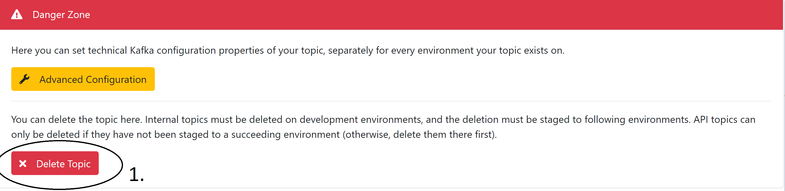
   
   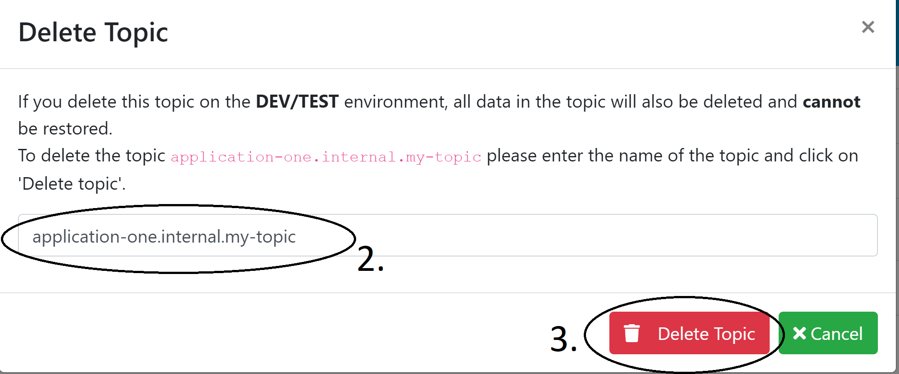
   
   You can then stage this "change" (deleting the topic) from DEV / TEST to PROD (see previous section). As already
   written in the last section, you should of course pay particular attention to whether you put an ongoing
   productive instance of your application in danger... Galapagos does not stop you from doing that!
   
   
### Delete API Topics
   
   The API topic works the other way around. You can only delete API topics if they do not **exist** on the **next** stage.
   You can delete API topics in Production ... if they are no longer subscribed to by any application! If there are still subscribers,
   you have to get in touch with them and tell them to stop subscribing to your topic. As soon as there are no subscribers,
   the "Danger Zone" appears for the Production environment and allows you to delete your topic. You can then delete it
   on DEV / TEST if there are no more subscribers of course.
   
## Deprecation of API Topics

   To inform other teams that an API topic should no longer be used, you can mark it as "deprecated". To do this,
   go to the respective topic via the "Browse Topics" tab. If your application owns the topic and it is not an internal
   topic, a new area appears to mark topics as deprecated:
   
   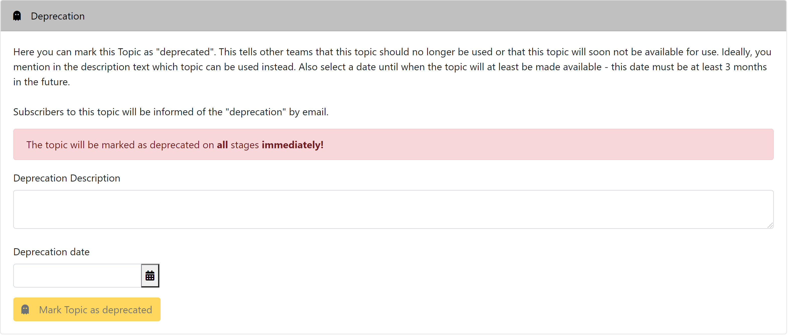
   
   Here you state why the topic should no longer be used and when it will be deprecated. Then click the yellow button to
   mark the respective topic as deprecated. All subscribers to this topic will be informed of the deactivation by email.

   After a topic is marked as deprecated, this becomes visible on the surface. On the overview of the individual topic,
   a note appears next to the name of the topic that this topic can no longer be used in the near future:
   
   
   
   In addition, under the "Browse Topics" tab, topics are marked with a line through the name of the topic:

   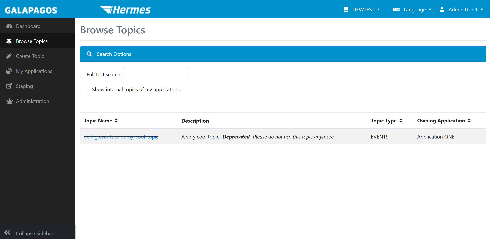
   
   In addition to the description of the topic, there is another indication that the respective topic is deprecated,
   followed by the deprecation text.

## Undeprecation of API Topics

   If you decide that a topic should no longer be marked as deprecated, you can remove this marking. To do
   this, go to the respective topic via "Browse Topics".
   
   If you own the respective topic and it is marked as deprecated, the following button appears in the "Usable until"
   row  to remove it:
   
   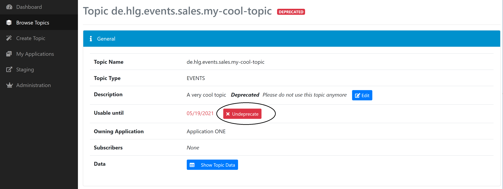

   After you have clicked the button, the "Usable until" row disappears and the topic is no longer deprecated.


## Change advanced topic settings

   In Galapagos you can change settings for your topics, like retention time or cleanup policy, as a "convenience" function.
   You can also do this via the Kafka AdminClient API or with another Kafka tool! Here Galapagos is really "just" a tool
   with a view to the Kafka configuration.
   
   To change the advanced settings for your topic, search for your topic again using "Browse Topics". Check the box next
   to "Show internal topics of my applications" if it is an internal topic. Click on the desired topic.
   
   In the info view for your topic, scroll down to the "Danger Zone". There you will find a button, "Advanced Configuration".
   Click on it and you get to the configuration editor for your topic:

   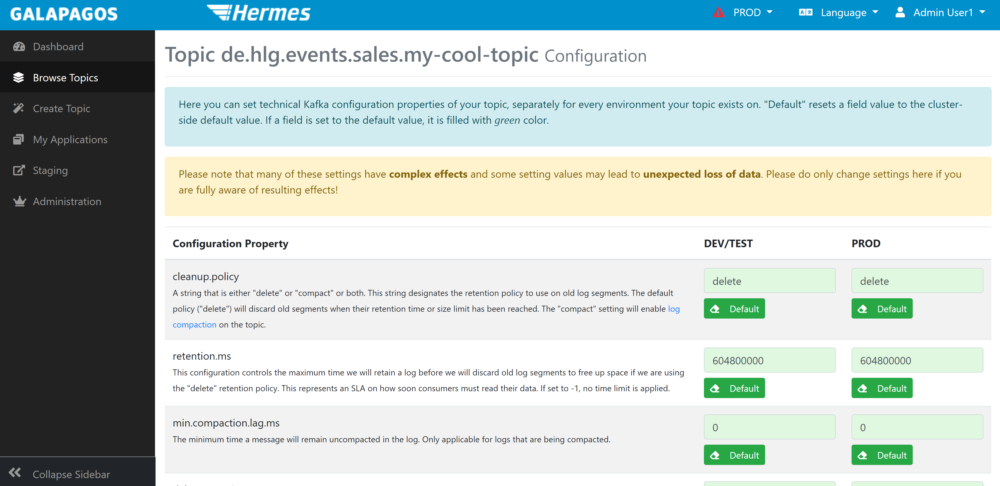
   
   You can change each setting separately for each environment in which your topic exists. With the green "Standard" button
   you can restore the cluster-side standard value (Warning: This could theoretically differ between the different clusters!).
   To apply your changes, scroll all the way down on the page and click "Update Topic Configuration". When you stage a topic
   in a new environment for the first time the settings from the previous environment are used. After staging you can of 
   course change it again.


