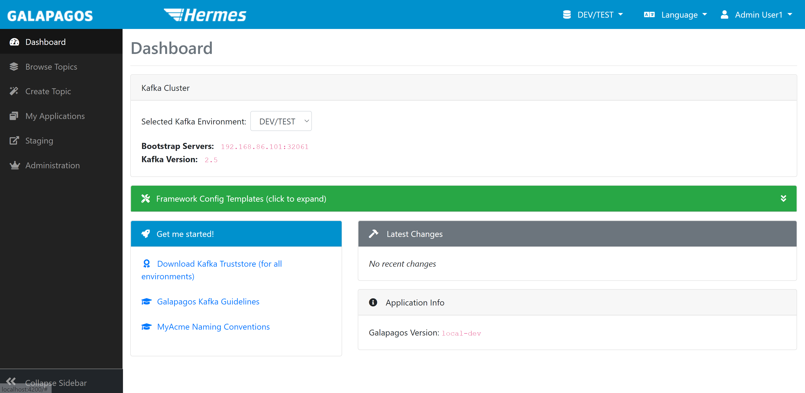
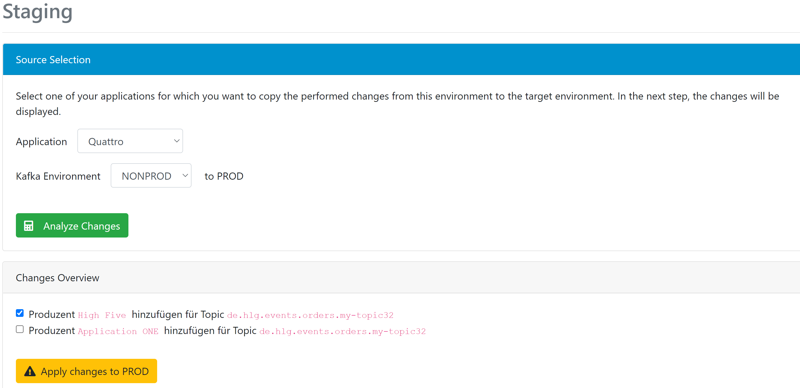

# Galapagos User Guide

In the next Sections we assume that you have setup the three environments DEV, INT, and PROD.

## Log in / First access

When first opening Galapagos, you need to authenticate yourself. You will see 
a small window asking you for your keycloak credentials. Here you can enter 
a valid combination of username and password. 

<p>

</p>

After successfully entering your username and password, you will be redirected to
Galapagos and land on the start screen.

<p>

</p>

You can already find several elements here:

  * The menu on the left. Here you can jump to the main functions of Galapagos.
  * The info bar above. Here you can change the current Kafka environment and also change the language of the user interface. 
  * The individual pages, which are discussed in more detail in the following sections.

## Get basic and connection information

On the dashboard (see screenshot above) you will find the following elements:

  * Information about the current Kafka cluster.You can use the "Bootstrap Servers" e.g. in your
    properties file for the Kafka connection in your application (Kafka property `bootstrap.servers`).
  * Useful start links. 
  * The "Latest Changes" on the selected Kafka cluster.
  * The Galapagos version.
  
  The first thing you will find under the start links (as shown in the image below based on `spring` framework) is the so-called "Kafka Truststore". This is a 
  Java keystore (JKS format) that contains the (self-signed) root certificates of the individual Kafka environments 
  as "Trusted Certificates". If you integrate this truststore via your Kafka properties (standard Kafka properties 
  `ssl.truststore.location` and `ssl.truststore.password`, password = changeit), your Kafka client trusts the Kafka 
  clusters when establishing the connection.

  <p>
  
  </p>
  
  Please note that you also need a client certificate to establish a successful connection! Information on this can
  be found below in the section "Receive a client certificate".

## Search Topics

  To search for existing "API-Topics" (Topics universally visible and readable on-subscribe, see section "Subscribe to topic") on the current Kafka environment go to the menu "Browse Topics".
  The following screen appears:

  <p>
  
  </p>
  
  You can sort the topics here and search (filter) names, descriptions and owning applications. To sort, click on the double arrows
  next to the column headings. To filter, enter a search text in the text box above.

  If you are already "Topic Administrator" for one or more applications (see next section), you can create internal topics of these 
  applications visible with the checkmark "Show internal topics of my applications". 
  
  To view details about a topic, click on the topic name. Here
  you can see the JSON schema of the content of the topic (if one has been published) and its subscribers.
  
## Become a topic administrator

In order to be able to do more extensive actions with Galapagos (especially create or subscribe to topics), you have to
become "Topic Administrator" of at least one application. To do this, switch to "My Applications" via the menu on the
left. Here you can make a request to become a topic administrator of an application. Then select an application in the "
Request" section. Optionally enter a comment why you should get this right (e.g. "Developer in Team XYZ"). The comment
makes it easier for the Galapagos admins to check whether to grant the Topic Administrator role or not. Then click on "
Submit Request". Your request will be saved, and the Galapagos admins will receive an email to review and approve the
request.

   <p>
   
   </p>

After an administrator has checked and approved your request, you will receive your approval via e-mail. Then you can
use the extended functions of Galapagos for this application.

## Generate client certificate

In order to connect to the kafka cluster and to be able to store application rights, it is necessary to have a client
certificate issued. Without a certificate for an application, you cannot create topics for this application via
Galapagos. Please note that since Galapagos 2.1.0 generating a certificate is not the only option to connect to your
kafka cluster. You can also use API Keys for this. For more information please have a look
at [Confluent Cloud Support](#Confluent Cloud Support). To generate a client certificate, go to "My Applications" and
click on "Create Certificate now" for one of your application on the environment for which you want to get a client
certificate:

   <p>
   
   </p>
   
   A dialog for generating the certificate in the selected Kafka cluster opens:

   <p>
   
   </p>

  There are two options for generating the certificate. You can either have the private key and the certificate
  generated by Galapagos and receive a .p12 file, or you can upload a CSR (Certificate Signing Request)
  and receive the signed certificate. For security reasons, only the CSR variant is permitted for 
  the productive cluster (to prevent that the private key is transmitted over the network).
  
   Select one of the two options in the dialog above. Depending on your choice, your browser downloads a file
   after clicking on "Generate Client Certificate":
  
   * When using a CSR, you will receive the signed certificate as a .cer file (PEM-coded X509)
   * When the private key is generated by Galapagos, you will receive a .p12 file that is "protected" with the password "changeit". 
     You can use it as a client certificate for your Kafka client via the Kafka properties `ssl.keystore.location`,
     `ssl.keystore.password` and `ssl.key.password`.
     
   When choosing the CSR variant, Galapagos gives you a finished openssl command that you can execute on your
   command line or Git Bash (choose which type of command line you are using)! A key file (.key) is created (
   you need write access to the current directory in your terminal!) and the CSR is output on the command line. You can
   copy and paste this into Galapagos: 

   <p>
   
   </p>
   
   When you have received the signed certificate, you can use openssl to create a .p12 file (Windows; under Linux or Mac OS you
   can omit winpty):

```
winpty openssl pkcs12 -export -out myapp.p12 -inkey myapp.key -in myapp.cer
```

   openssl asks for an "Export Password". This password protects the .p12 file (after all it
   contains your private key!). Galapagos always uses "changeit" for .p12 files (see above). You can use whatever
   you want here - you just have to specify it in your Kafka Properties together with the file.
   
### Extend certificate      

   If the client certificate for your application is about to expire, you can extend it via the user interface. 
   To do this, go back to the certificate dialog for the respective environment and switch to
   the "Extend existing Certificate" tab:

   <p>
   
   </p>

   Note that the expiration date is also shown in this dialog. You can always check the expiration date here, but 
   you will also be notified by Galapagos when the certificate is about to expire.

   Here you will find an openssl command as well. However, this requires the private key for the existing certificate. If you "only" have the .p12 file, you can
   extract the private key as follows: 
   
```
winpty openssl pkcs12 -in <myclientkeystore.p12> -nocerts -nodes -out <myprivatekey.key>
```

   You will then be asked for the password for your P12 keystore on the command line, so don't forget
   the winpty (under Windows), otherwise the openssl process will hang! 
   
   Otherwise you can proceed as described above. Execute the command that Galapagos lists for you and
   copy the CSR to Galapagos into the text box. You will now receive a certificate that contains the
   same identifier as your previous certificate (and uses the same private key), but is (depending on
   the environment) valid for 1 or 2 years. The previous certificate can still be used (as long as it
   is valid), just exchange it at the next opportunity.
   
### Replace certificate

   If you have lost the private key or have to recreate the client certificate for any other reasons, you can proceed in exactly the same way as when re-issuing the 
   certificate (but not as with the renewal). Please note that the previous certificate immediately
   loses its validity when the new certificate is generated! If the application is already running 
   in a prod-environment with the private key and you "just" can no longer access it, you could kill your 
   application by generating a new certificate! Galapagos will warn you when trying to generate a new certificate, if you already 
   have one:

   <p>
   
   </p>
   
## Create developer certificate   
       
   Depending on your team organization and deployment strategy, not every developer should have the private key of 
   your application - especially not for production. You may still have to be able to look 
   at the topics during production, for example. There are tools for this, but of course these also require a client
   certificate (and the trust store) for the connection to connect to Kafka. 
   
   Therefore, you can get a developer certificate with Galapagos. This basically grants you the same rights as the
   applications of which you are the Topic Administrator ("My Applications"), but are always very limited in time.  
   
   To create a developer certificate, click on your name in the top right corner in Galapagos. Now select
   "User Settings" in the menu. The following screen opens:

   <p>
   
   </p>
   
   Select an environment for which you would like to get a developer certificate. If you had already created a certificate for that environment,
   it becomes invalid immediately after the creation of a new certificate.
   
   Click on "Generate developer certificate" and you will receive a .p12 file for download. The file-
   password is "changeit".
   Your username is encoded in the certificate - so don't grant others access to the certificate.
   
## Create internal Topic   
   
   Internal Topics can be used for the communication between different components of your application.
   You can use Galapagos to create an internal Topic: Go to "Create topic" via the menu on
   the left. Select the topic type "App internal". Select your owning application and the target environment (the direct creation of topics is only 
   allowed on the DEV environment with Galapagos!). Galapagos automatically generates a
   suggestion for the topic name.

   <p>
   
   </p>
   
   You can also enter a description of the contents of this topic. This is not so important for
   application-internal topics, but it can help you or your team members. Note that users without 
   the "Topic Administrator" right in Galapagos for your application cannot see this topic. 
   Neigther can any other application read from or write to this 
   topic. Now Click on "Create topic" to create the topic on the selected Kafka cluster.
   
   
### Advanced topic settings   

   When creating the topic, you can specify the number of partitions your topic should consist
   of (Default: 6 Partitions). If you don't know what this setting does, you should definitely
   use the default value. If you use fewer partitions, you or the readers of the topic may be robbed of 
   scaling options. If you use too many, access to your topic may be less efficient.
   
   The number of partitions is **very difficult** to change after creation (and not at all via Galapagos) and
   you should be careful with your settings.
   
   You can change other advanced settings such as retention time and cleanup policy at any time **after**
   creating the topic, therefor these settings aren't available here (see last chapter).
   
## Subscribe to a Topic   
   
   If you find an API topic from another application you'll like to
   consume with your application, you have to subscribe to the topic for this application. This process
   grants the client certificate of your application in the Kafka cluster the right to read from this 
   topic.
   
   To subscribe to a topic, select the topic via "Browse Topics" and click on it. Further down on
   the info page for this topic you will find the section for the Subscription:

   <p>
   
   </p>
   
   Select the application that wants to read from this topic and click on "Subscribe". Your
   application will then appear at the top of the info page as a subscriber to this topic.
   
   If you have not yet created a client certificate for your application in the current environment,
   the Kafka rights cannot be assigned. Again, Galapagos will give you a warning if you do not have
   a client certificate yet:

   <p>
   
   </p>
   
   If the topic you want to subscribe to is marked as a "sensitive topic" (e.g. it contains personal data)
   the owning team must **approve** your subscription before your application has read access to the topic.
   The owning team will be notified of your subscription request by email, and you will be notified by email if
   the approval has been granted or declined.
   
   To **cancel** your subscription (see screenshot below), click on the "Unsubscribe" Button behind the entry for your application in the list
   of subscribers. Note that in this case the rights to the current environment will be revoked
   immediately! Therefore you should consider whether a productively running instance of your application could still
   be dependent on the subscription!

   <p>
   
   </p>
   
## Create API Topic

   At some point, you want to make business events in your application available to other applications.   
   To create an API topic, proceed similarly as for internal topics. Select "Create topic" in the left menu and select target
   environment (only DEV is possible for creation) and your application. Select the appropriate topic type.
   A few new input fields now appear:

   <p>
   
   </p>
   
   One of the new fields is the business capability field. Select the appropriate one for you here. Again, Galapagos
   calculates a suitable topic name from the selected values.
   
   The "Description" field now has a much more important role. Other users will see this as the first information on
   your topic and can search through it. A meaningful description of the (future) content of the topic is strongly recommended.

### Personal data in topics

   If your topic basically contains personal data (possibly only on a later stage, e.g. in production!), You have to mark this when you
   create the topic (see below). Now every subscription to this topic must be explicitly approved by you (by you or a member of
   your team who is also allowed to manage this topic in Galapagos). You or your Team have to assess whether the 
   requesting team / the requesting application has a legitimate interest in the published data.

   <p>
   
   </p>
   
### Upload JSON schema   
   
   To make your topic a reliable data source, you should publish an associated **JSON schema**. You can specify this schema on-creation, but it's not mandatory.
   You can add the JSON schema at any time via the topic's info page (via "Browse Topics").
   Please note that Galapagos always **checks new schema versions for consumer compatibility**! 
   You cannot make certain changes in a consumer-compatible manner (e.g. increasing the size of string fields if they were
   previously limited in length - perhaps the size of a database field depends on it somewhere and would then overflow). **Incompatible**
   changes usually require creating a new topic and marking the old topic as deprecated.
   When you want to stage your topic from DEV into production (see next section), you must have published an
   associated JSON scheme, otherwise Galapagos will refuse to stage the topic.
   
### Delete JSON schema   
   
   After a JSON scheme has been created, you can also delete it. Note that only the last published JSON schema can be
   deleted. Additionally you cannot delete the JSON schema if there are subscribers on the respective topic or if the JSON schema to be
   deleted has already been staged. In the latter case, you must first delete it on the next stage and afterwards delete it on the
   current stage.
   
   If both conditions are met (the topic has no subscribers and the schema has not been staged) the button "Delete schema version" appears 
   on the user interface:

   <p>
   
   </p>
      
   You can of course use this button several times to remove all JSON schemas of a topic.
   
## Staging   
   
   If you are satisfied with your changes (this includes newly created topics, published Json Schemas, but Subscriptions to an API
   topic as well) in the context of one of your applications, you can transfer the changes to the 
   next "stage". Galapagos knows the three stages DEV, INT and PROD.
   
   The staging process ensures that the two environments do not completely diverge structurally. It should encourage you to test 
   your changes on DEV first before going into production.
   
   To transfer your changes for an application, select "Staging" in the left menu. Then select the desired source environment and
   the application. The target environment is calculated automatically.
   
   Then click on "Analyze Changes". If you have not yet created a certificate for your application on the target environment,
   you will be made aware of this at this point. Otherwise, Galapagos will show you the changes to
   be published to the next stage:

   <p>
   
   </p>
   
   In case you don't want to stage all changes to the next stage, just uncheck the respective checkbox.
   The deselected changes will not be present on the next environment.
   
   With a click on "Apply changes to xy" the individual changes are carried out to the target environment. Galapagos will
   then show you which changes are successfully staged and which possibly not.

## Delete Topic

Sometimes you certainly want to delete a topic. Of course, it's not that simple in a system that is intended for
decoupled communication between different applications. Therefore, strict rules are in place regarding when and where a
topic can be deleted:

### Delete internal Topic

If you want to delete an internal topic that you (or someone else from your team) created using Galapagos, you always
have to do this on the DEV stage first. There you can search for your topic via "Search Topics", click on it and find
the "Danger Zone" at the bottom of the page to delete the topic. To confirm the deletion, enter the entire topic name
into the input field:

   <p>
   
   </p>  

   <p>
   
   </p>

Then you can stage this "change" (deleting the topic) from DEV to PROD (see previous section). You should of course pay
attention to whether you put an ongoing productive instance of your application in danger... Galapagos does not stop you
from doing that!

### Delete API Topics

The API topic works the other way around. You can only delete API topics if they do not **exist** on the **next** stage.
You can delete API topics in Production ... if they are no longer subscribed to by any application! If there are still
subscribers, you have to get in touch with them and tell them to stop subscribing to your topic. As soon as there are no
subscribers, the "Danger Zone" appears for the Production environment and allows you to delete your topic. You can then
delete it on DEV if there are no more subscribers of course.

## Deprecation of API Topics

To inform other teams that an API topic should no longer be used, you can mark it as "deprecated". To do this, go to the
respective topic via the "Browse Topics" tab. If your application owns the topic and it is not an internal topic, a new
area appears to mark topics as deprecated:

   <p>
   
   </p>

Here you state why the topic should no longer be used and when it will be deprecated. Then click the yellow button to
mark the respective topic as deprecated. All subscribers to this topic will be informed of the deactivation by email.

After a topic is marked as deprecated, it becomes visible on the surface. On the overview of the individual topic, a
note appears next to the name of the topic that this topic can no longer be used in the near future:

   <p>
   
   </p>   

In addition, under the "Browse Topics" tab, deprecated topics are crossed out:

   <p>
   
   </p>

In addition to the description of the topic, there is another indication that the topic is deprecated, followed by the
deprecation text.

## Undeprecation of API Topics

If you decide that a topic should no longer be marked as deprecated, you can remove this marking. To do this, go to the
topic via "Browse Topics".

If you own the topic and it is marked as deprecated, the following button appears in the "Usable until"
row to remove it:

   <p>
   
   </p>

After you have clicked the button, the "Usable until" row disappears and the topic is no longer deprecated.

## Change advanced topic settings

In Galapagos you can change settings for your topics, like retention time or cleanup policy, as a "convenience"
function. You can also do this via the Kafka AdminClient API or with another Kafka tool! Here Galapagos is "just" a tool
with a view to the Kafka configuration.

To change the advanced settings for your topic, search for your topic using "Browse Topics". Check the box next to "Show
internal topics of my applications" if it is an internal topic. Click on the desired topic.

In the info view for your topic, scroll down to the "Danger Zone". There you will find a button, "Advanced
Configuration". Click on it and you get to the configuration editor for your topic:

   <p>
   
   </p>

You can change each setting separately for each environment in which your topic exists. With the green "Standard" button
you can restore the cluster-side standard value (Warning: This could theoretically differ between the different
clusters!). To apply your changes, scroll all the way down on the page and click "Update Topic Configuration". When you
stage a topic in a new environment for the first time the settings from the previous environment are used. After staging
you can of course change it again.

In the next Section about Galapagos 2.1.0 we assume that you have setup environments NONPROD and PROD.

## Confluent Cloud Support

Since Galapagos 2.1.0, we now have support for Kafka Clusters that are managed by Confluent Cloud. This means, you can
generate the required credentials to authenticate your applications to the Confluent Cloud Clusters. These credentials
include an API Key and a Secret. Well, so how to get these credentials? Go to "My Applications" to register your
Application on the current Environment. Search for your Application and then click on "Create Api Key now". The
following dialogue opens:

   <p>
   
   </p>

By clicking on "Generate API Key", you will get the credentials you need, and you can just copy them from the table.
Please note that Galapagos will not save your secret, so you should not lose it. And now? Well, after you got your
credentials it is time to use them. You will need to insert your credentials into the Framework Config Template. If you
are in the "ccloud" mode (more on that later), then the template looks as follows:

   <p>
   
   </p>

This way your Application is able to authenticate itself to the Confluent Cloud Clusters and can produce messages on the
topics hosted on the managed clusters.

If you already have an API Key and want to generate a new one, then you can do this. Again go to "My Applications" and
search for your Application. This time, since you already have a key you will see a "Card" for your Application, that
contains three panels. One of them is called "Client Access":

  <p>
   
   </p>
By clicking on "Client Access", the panel will open and you will see a button called "New login details", which you can
also click such that the dialogue you saw before will appear.

Please note that doing so the previous API Key loses its assigned Kafka permissions and becomes unusable. Existing
permissions are transferred to the new API Key.

### Certificates/ccloud mode

Since Galapagos 2.1.0, you can configure Galapagos in such a way, that it understands both, certificates and Confluent
cloud. This means you could have one on-prem cluster, where you can authenticate yourself using SSL Certificates and
another cluster, which is a managed one by Confluent, which uses API Keys for authentication. This way you could for
example create a Topic on an environment called NONPROD, which is based on an on-prem cluster and stage it to the next
stage PROD, which is based on a managed cluster by confluent. Please note that the UI will at some points will look
slightly different for both modes. For example on the "My Applications" Page, the third panel on each "Card" will look
different since one is for creating a certificate and the other one is for generating your key or on the dashboard page
you will see not kafka truststore since in case of a managed cluster you do not need it.

## Additional producers for a Topic

### Add a Producer

In Addition to the owning Application, you can add several other Applications, that are privileged to write to a
specific topic. To do so, navigate to your Topic and scroll down to the "Danger Zone". There you will find a button "add
additional producers". By clicking this button, the following dialogue opens:

   <p>
   
   </p>

Here you can select all registered Applications on the current environment. After the selection, a new row in the Table
on the single topic page with the name "additional producers" will appear. There you can see all producers (if any) that
you have added. This means, those producer applications got the correct ACLs, such that they can produce messages on a
given topic.

### Delete a Producer

After you added a producer, you can also just get rid of it by deleting the producer. To do so, navigate to your topic.
If the Topic already has some producers, you will notice two buttons. For deletion, you need the red buttons:

 <p>
   
   </p>

By clicking it, the following dialogue opens:

<p>
   
   </p>

if you are sure you want to delete the producer, then just click on "delete Producer", and it will be gone. By deleting
a given producer, the ACLs are removed. This way the producer cannot write to the topic anymore.

### Stage adding/deleting a Producer

What about staging? Well, since it is only possible to add additional producers for a Topic on a non-staging
environment, you will need to stage this change (adding producers). To do so, go to the "Staging" Section using the
Sidebar. Choose the right Application and the source Environment. In the given example, we assume we have an Application
named "Quattro" and we want to stage from NONPROD to PROD. By clicking on "Analyze Changes", you will see the following:

   <p>
   
   </p>

As you can see in the "Change Overview" Section, there are two producers that were added on the NONPROD Environment and
are now ready to be staged to the next Environment, which in this case is PROD. You can now stage as many producers as
you want. The ones that you do not stage now, you can of course stage later. This Procedure is also valid for staging
the deletion of a Producer. If you for example deleted an additional producing application on NONPROD and want to stage
this change (the deletion) on PROD then just do the same as written above for the case that adding a producer is staged.

## Change Owner of Topic

After adding a producer there will appear another Button next to the "delete producer" Button, which is called "change
owner of topic". Using this Button you can promote a producer to the new Owner of the current Topic. The former Owner
will be "just" a producer, so it will still be able to produce messages on the topic. By clicking it, the following
dialogue opens:
<p>

   </p>
Here you will be again asked whether you are sure to change the owning Application. By confirming, the roles of the
producer and the current Owner will swap. Of course, you can just use the button again, if you want the former Owner to be
again the owning Application of the topic. Please note that it is only possible to change the owner for API Topics, so
the Owner of a internal Topic cannot be changed.
